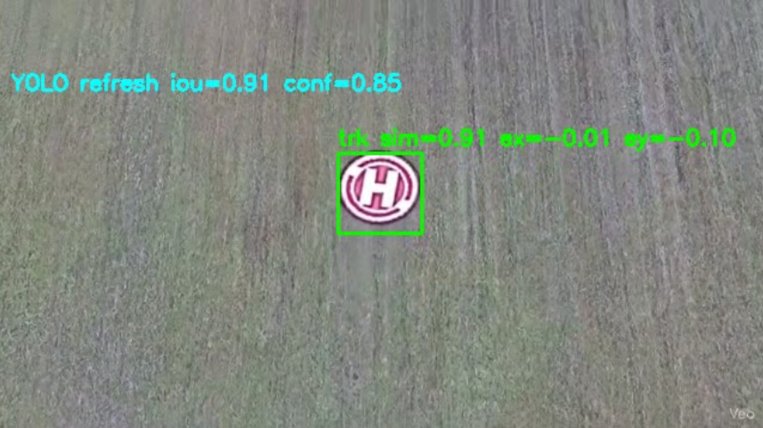
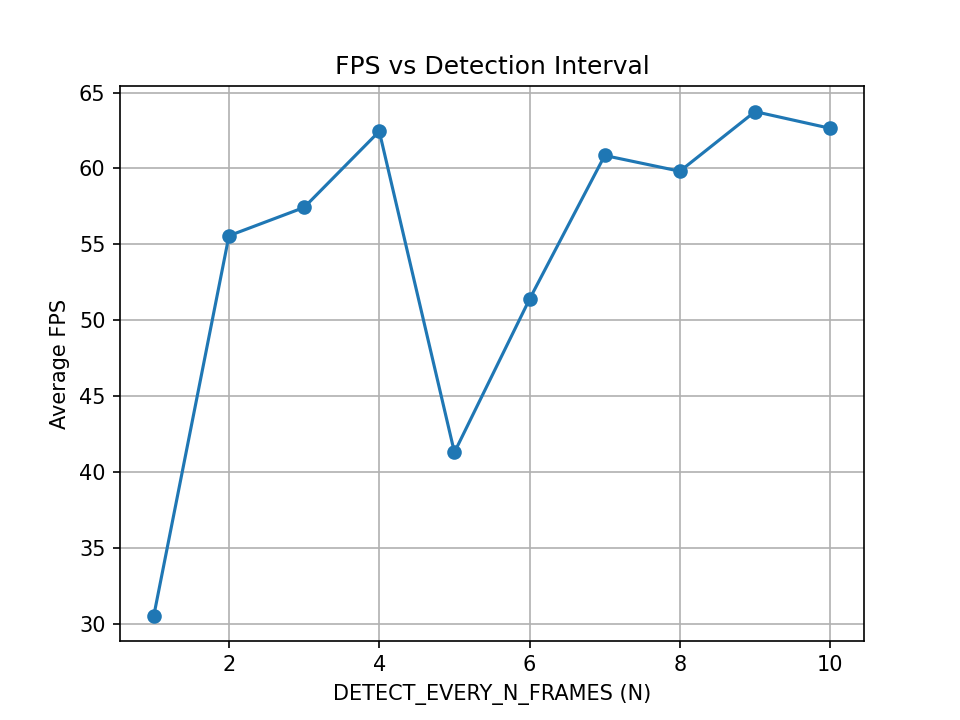
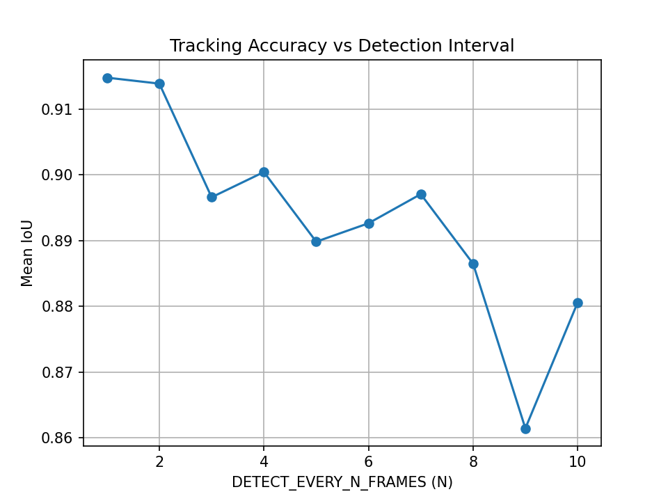

# YOLO-Assisted-Object-Tracking-Algorithm

This project presents a **hybrid object tracking algorithm** that combines
deep-learning–based object detection model (**YOLOv8n**) with a classical computer vision
tracker (**KCF**), supported by **data-driven analysis techniques** such as
HSV-based appearance modeling, statistical similarity metrics, and
Python-based performance evaluation.

The main objective is to design a **robust and real-time object tracking system**
that minimizes computational cost while maintaining stable tracking under
challenging conditions such as motion, scale changes, and partial drift.

You can reach the dataset I used for the training of the model in:
https://universe.roboflow.com/test-323am/landingpad-6n3go

KCF algorithm is chosen because of its to use minimal memory, which makes it a great use for UAVs.

## Algorithm Overview

The system operates in two main modes:

### 1️⃣ Detect Mode
- YOLOv8n detects the target object.
- The most confident bounding box is selected.
- The KCF tracker is initialized.
- A visual appearance signature (HSV histogram) of the target is extracted.

### 2️⃣ Track Mode
- KCF tracks the object at every frame (high FPS).
- Histogram similarity is used to detect drift.
- YOLO is periodically invoked to:
  - Validate the tracker output
  - Re-initialize tracking if drift is detected

This design ensures **high performance** while preserving **tracking reliability**.

## Detection Interval Design

YOLO is invoked every **N frames** (`DETECT_EVERY_N_FRAMES`) as part of the tracker
validation process.

- Smaller `N` → higher accuracy, higher computational cost  
- Larger `N` → higher FPS, increased drift risk  

A quantitative analysis was conducted for **N = 1 … 10** to understand this trade-off.
Based on speed, stability, and accuracy metrics, the final system uses:

> N = 7 as a balanced design choice.

## Tracking Metrics & Evaluation

The following metrics are logged per frame:

- Frame processing time (ms)
- Effective FPS
- YOLO invocation events
- Tracker re-initialization events
- Histogram similarity (drift indicator)
- IoU between YOLO and tracker bounding boxes
- Tracker loss counter

All experimental data is stored in the `metrics/` directory and visualized using
Python-based analysis scripts.

### Validation Data Note

The validation video used in this repository was generated using an AI-based
video generation tool (Google Gemini) for demonstration purposes.
It does not represent real-world footage and is used solely to visualize
the behavior of the tracking algorithm.

